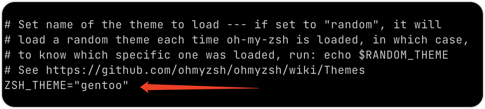
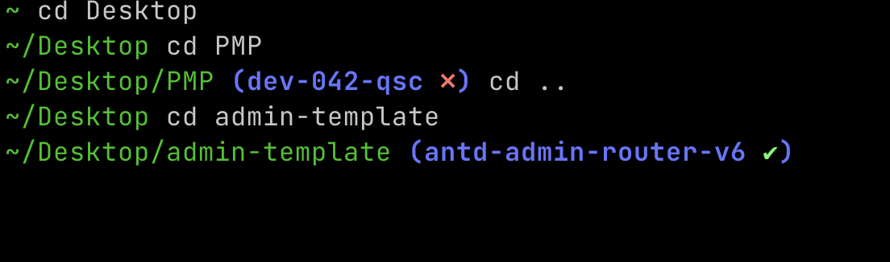
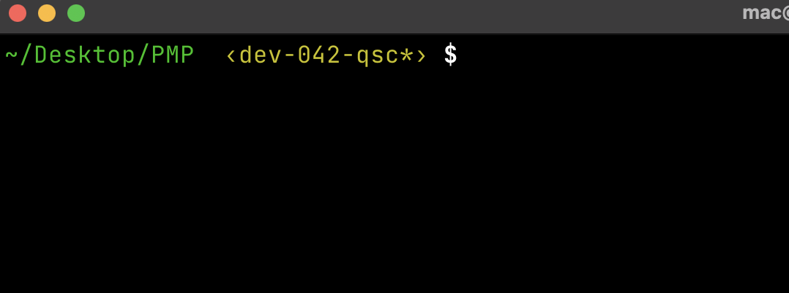
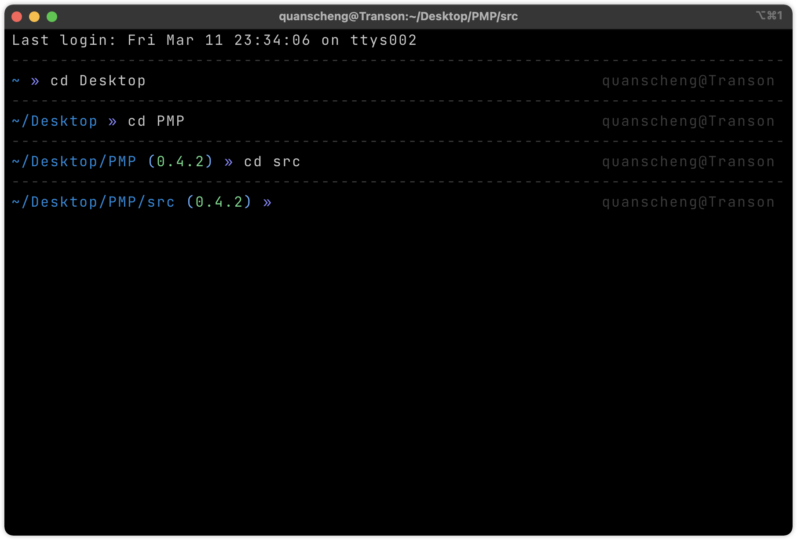
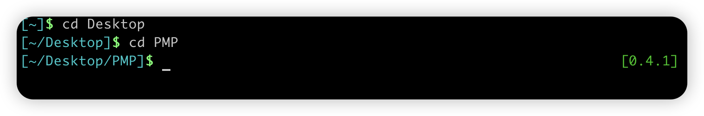
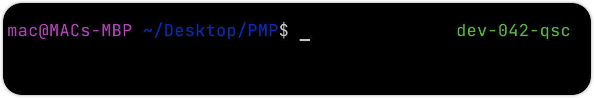
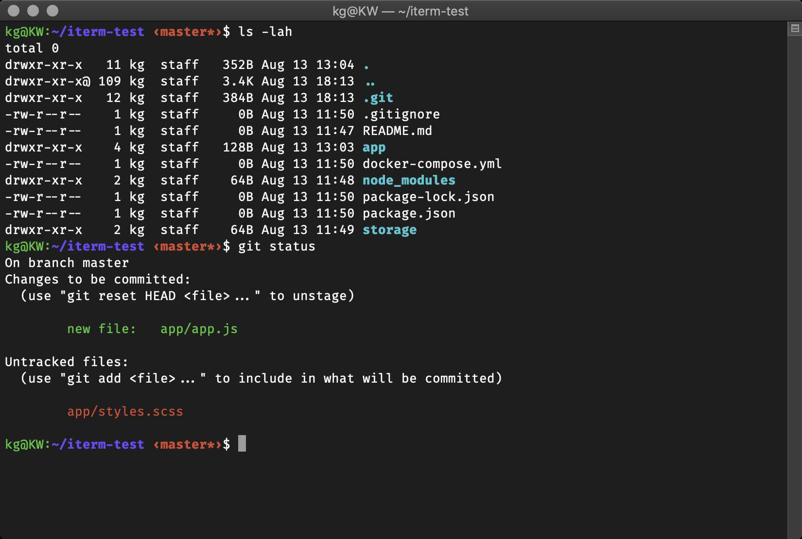

### 安装和使用

1. [链接:ohmyzsh](https://github.com/ohmyzsh/ohmyzsh)
2. `cd ~`
3. `la`
4. 看一下列表里面是不是有`.zshrc` 如图: 

5. `vim .zshrc` 找到 `ZSH_THEME="这是主题名字"` 

6. [链接: 主题总览](https://github.com/ohmyzsh/ohmyzsh/wiki/Themes)
7. 找到自己心仪的主题,在步骤5里面更换主题名字
8. 在vim 编辑器中`i`进入编辑模式,键盘点击`del`删除已有的名字, 并粘贴想要更换的名字
9. `:wq + Enter`
10. 重启终端
11. 主题节选如下: 

### simple (会提示git暂存是否干净 ❎  和 ✅ )

### macovsky

### af-magic

### gallois

### alanpeabody

### tjkirchtheunraveler

