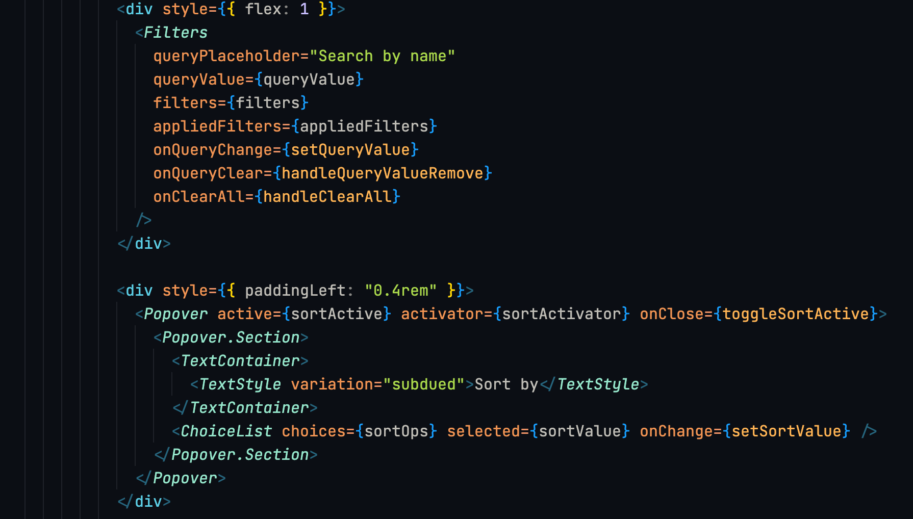
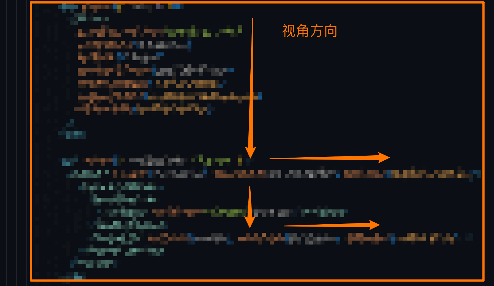
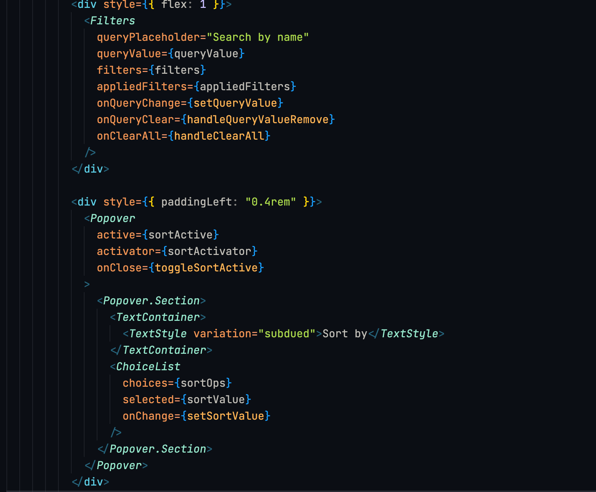
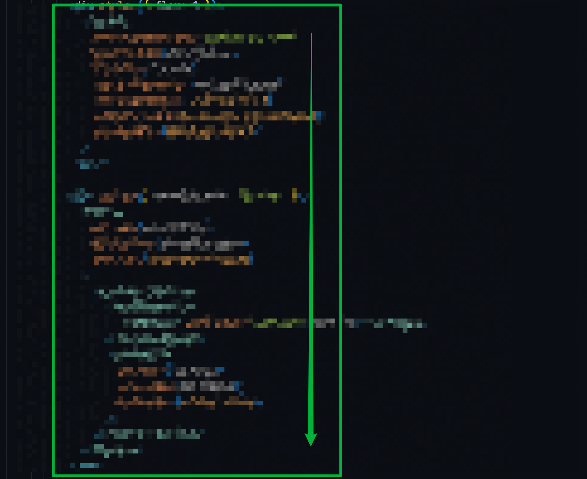

## 背景

几乎每个项目都会有对应的 eslint 规则和 prettier 格式化配置,因为 eslint 负责代码质量,prettier 负责代码格式.

当业务代码 jsx 越写越多发现一个问题, 自上而下阅读代码时候:

- 属性少的一行显示
- 属性多的每个属性独占一行,

当然这跟 printWidth 的大小有关, 用宽度来决定代码换行是一种不确定行为. 比如下面实际案例:

```jsx
 <div style={{ flex: 1 }}>
 {/* 多个属性成列显示 */}
  <Filters
    queryPlaceholder="Search by name"
    queryValue={queryValue}
    filters={filters}
    appliedFilters={appliedFilters}
    onQueryChange={setQueryValue}
    onQueryClear={handleQueryValueRemove}
    onClearAll={handleClearAll}
  />
</div>

<div style={{ paddingLeft: "0.4rem" }}>
 {/* ①  ↓  此处由于还没有到达换行长度,三个属性一行展示  --> */}
  <Popover active={sortActive} activator={sortActivator} onClose={toggleSortActive}>
    <Popover.Section>
      <TextContainer>
        <TextStyle variation="subdued">Sort by</TextStyle>
      </TextContainer>
      <ChoiceList choices={sortOps} selected={sortValue} onChange={setSortValue} />
    </Popover.Section>
  </Popover>
</div>
```

当自上而下的阅读代码时候, 到达位置 ① 会刻意从左到右阅读

当独占一行`singleAttributePerLine:true`的效果

```jsx
<div style={{ flex: 1 }}>
  <Filters
    queryPlaceholder="Search by name"
    queryValue={queryValue}
    filters={filters}
    appliedFilters={appliedFilters}
    onQueryChange={setQueryValue}
    onQueryClear={handleQueryValueRemove}
    onClearAll={handleClearAll}
  />
</div>

<div style={{ paddingLeft: "0.4rem" }}>
{/* 注意力始终是朝向一个方向 ↓ */}
  <Popover
    active={sortActive}
    activator={sortActivator}
    onClose={toggleSortActive}
  >
    <Popover.Section>
      <TextContainer>
        <TextStyle variation="subdued">Sort by</TextStyle>
      </TextContainer>
      <ChoiceList
        choices={sortOps}
        selected={sortValue}
        onChange={setSortValue}
      />
    </Popover.Section>
  </Popover>
</div>
```

自上而下的执行, 自上而下的阅读, 让阅读代码的注意力与 js 执行代码的方向一致, 可能会有更轻松的阅读体验.

## 图示

- 更改前的效果



- 更改前的视角方向



- 更改后的效果



- 更改后的视角方向



> 以上为个人观点, 每个项目都有适合自己的格式化方式 :) 比如个人阅读英文单词的时候第一眼扫整个代码区域无非就两个最快的直观感受, 属性的长度和首字母, 每个组件的属性单独一行可以最快速的定位到需要寻找的属性值
