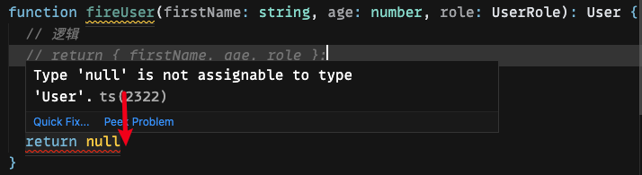
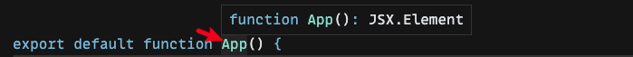
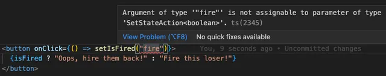
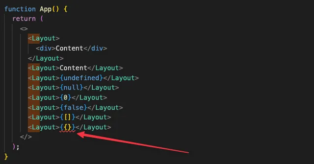
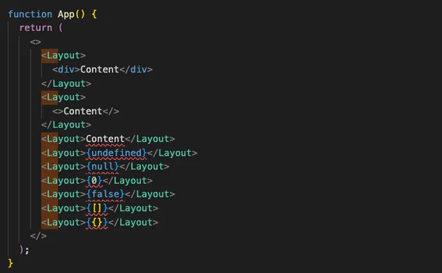
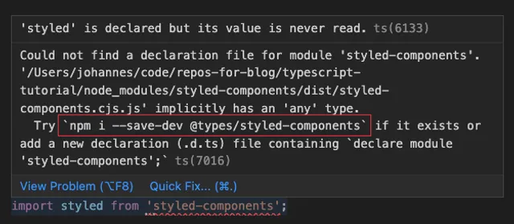
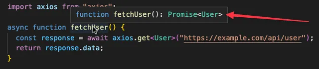
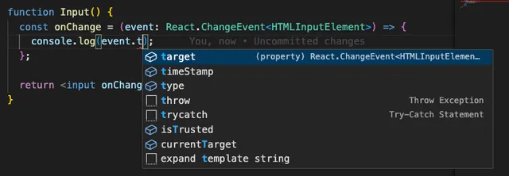
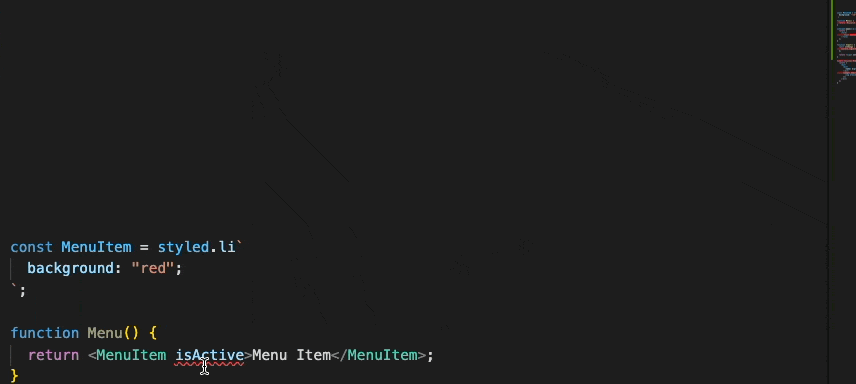

> *前端开发*的最小上手指南

## 类型

### 基本类型
```ts
string // e.g. "Pat"
boolean // e.g. true
number // e.g. 23 or 1.99
```

### 数组
```ts
number[] // e.g. [1, 2, 3]

string[] // e.g. ["Lisa", "Pat"]

User[] // custom type e.g. [{ name: "Pat" }, { name: "Lisa" }]
```

### 对象
```ts
type User = {
  firstName: string;
  age: number;
  isNice: boolean;
  role: string;
  skills: string[];
  friends?: User[]; // 字段可选
}
```

使用 type 声明的类型约束对象的写法:
```ts
const tom: User = { ... }
// 或者
const jerry = { ... } as User
```

### 枚举
顾名思义就是约束在指定值范围之间
```ts
enum ProductStatus {
  DRAFT = "draft",
  PUBLISHED = "published",
}

type Product = {
  name: string;
  price: number;
  images: string[];
  status: ProductStatus;
};

const product = {
  name: "Shampoo",
  price: 2.99,
  images: ["image-1.png", "image-2.png"],
  status: ProductStatus.PUBLISHED,
} as Product;
```

### 函数

#### 函数的传参类型

直接传参
```ts
function fireUser(firstName: string, age: number, isNice: boolean) {
  ...
}

// 箭头函数
const fireUser = (firstName: string, age: number, isNice: boolean) => {
  ...
}
```

对象传参直接定义类型
```ts
function fireUser({ firstName, age, isNice }: {
  firstName: string;
  age: number;
  isNice: boolean;
}) {
  ...
}
```

对象传参抽取类型
```ts
type User = {
  firstName: string;
  age: number;
  role: UserRole;
}

function fireUser({ firstName, age, role }: User) {
  ...
}

// 箭头函数
const fireUser = ({ firstName, age, role }: User) => {
  ...
}
```

#### 函数返回值类型

可以直接在函数入参的小括号后面加上 `: 类型` 的方式
```ts
function fireUser(firstName: string, age: number, role: UserRole): User {
  // 逻辑部分
  return { firstName, age, role };
}

// 箭头函数
const fireUser = (firstName: string, age: number, role: UserRole): User => {
  ...
}
```

这强制返回正确的类型。如果不是声明的类型，编译器变报错，如下所示

> 如果不希望严格返回指定类型, 可以不写函数返回类型, TS 自行推断返回值。TS 位置越少月好，如果不清楚返回类型，可以将鼠标悬停到函数名为止，查看推断类型。

### 可能会遇到的概念

- [联合类型](https://www.typescriptlang.org/docs/handbook/2/everyday-types.html#union-types)
- `Record<Keys, Type>`匹配键值对[ Record 类型](https://www.typescriptlang.org/docs/handbook/utility-types.html#recordkeys-type)

## React + TS

在 react 中，使用上述 ts 知识通常是足够的，react 的函数组件和 hooks 就是一系列简单函数，组件传参 props 就是一个对象。在大部分案例中，甚至都不需要定义类型，ts 可以自动推断类型。

### 函数组件

在大多数情况下，不需要定义函数组件的返回值类型，只需要定义 props 对象中接收的传参类型。很多不接收 props 的函数组件不需要定义任何类型。
```tsx
function UserProfile() {
  return <div>If you're Pat: YOU'RE AWESOME!!</div>
}
```

通常 ts 项目会推断该函数组件返回值类型为`JSX.Element`


TS 的方便之处：如果我们在返回了一个非 JSX 的元素，TS 会通过报错提示我们组件返回的不是一个 JSX 元素。

### Props

```tsx
enum UserRole {
  CEO = "ceo",
  CTO = "cto",
  SUBORDINATE = "inferior-person",
}

type UserProfileProps = {
  firstName: string;
  role: UserRole;
}

function UserProfile({ firstName, role }: UserProfileProps) {

    if (role === UserRole.CTO) {
    return <div>Hey Pat, you're AWESOME!!</div>
  }
  return <div>Hi {firstName}, you suck!</div>

}
```

> 注意: 您会发现很多代码使用 `React.FC` 或 `React.FunctionComponent` 来声明组件。不过，不再推荐这样做了。

### 回调函数

在项目中，我们经常会传递回调函数作为 props 。如下案例：
```tsx
type UserProfileProps = {
  id: string;
  firstName: string;
  role: UserRole;
  // 回调函数的类型
  fireUser: (id: string) => void; // void 作为返回类型的时候, 表示无
};

function UserProfile({ id, firstName, role, fireUser }: UserProfileProps) {

  if (role === UserRole.CTO) {
    return <div>Hey Pat, you're AWESOME!!</div>;
  }

  return (
    <>
      <div>Hi {firstName}, you suck!</div>
      <button onClick={() => fireUser(id)}>Fire this loser!</button>
    </>
  );
}
```

### 默认 props

对于 TS 中的可选类型，组件的 porps 中的属性同样可以定义可选的属性。
```tsx
type UserProfileProps = {
  age: number;
  role?: UserRole;
}
```

当组件需要设定一个默认值且是可选的时候，可以解构 props 然后分配到需要默认值的属性上面：
```tsx
function UserProfile({ firstName, role = UserRole.SUBORDINATE }: UserProfileProps) {

  if (role === UserRole.CTO) {
    return <div>Hey Pat, you're AWESOME!!</div>
  }

  return <div>Hi {firstName}, you suck!</div>
}
```

### useState 自动推断类型

使用最多的 hook 就是`useState`，但在大部分场景中是不需要为其定义类型的，只需要设置好初始值，ts 可以推断此状态的类型。


在`tsx`中，如果使用`setState`方法时传入与初始值不同类型，那么 ts 将会报错。


### useState 手动添加类型

在某些特定的场景中，ts 不能推断类型的默认值（比如：数组默认值 `[]` ，无法得知数组元素类型）
```tsx
const [names, setNames] = useState([]); // 元素类型不明确

const [user, setUser] = useState(); // 无法推断是什么类型
```
上述的例子中：如果直接调用 setNames([ 'Tom', 'Lisa' ]) 时会报错: 不能指定类型。

> `useState`是用泛型实现的，可以传入我们指定的状态类型来手动定义状态类型

```tsx
// names 状态的类型是 string[] ,这样我们就明确了该状态的类型.
const [names, setNames] = useState<string[]>([]);

setNames(["Pat", "Lisa"]);

// user 的类型是 User | undefined (可以设置为一个 user 或者 undefined)
const [user, setUser] = useState<User>();

setUser({ firstName: "Pat", age: 23, role: UserRole.CTO });
setUser(undefined);

// user 的类型是 User | null (可以设置为一个 user 或者 null)
const [user, setUser] = useState<User | null>(null);

setUser({ firstName: "Pat", age: 23, role: UserRole.CTO });
setUser(null);
```

以上在项目中使用`useState`就足够了，另外注意：`useEffect` 不需要类型。

### 自定义 hooks

前面也说到：hooks 就是一个普通函数。那么：自定义 hooks 自然也是函数。定义类型的方式同函数。
```tsx
function useFireUser(firstName: string) {
  const [isFired, setIsFired] = useState(false);
  const hireAndFire = () => setIsFired(!isFired);

  return {
    text: isFired ? `Oops, hire ${firstName} back!` : "Fire this loser!",
    hireAndFire,
  };
}

function UserProfile({ firstName, role }: UserProfileProps) {
  const { text, hireAndFire } = useFireUser(firstName);

  return (
    <>
      <div>Hi {firstName}, you suck!</div>
      <button onClick={hireAndFire}>
        {text}
      </button>
    </>
  );
}
```

### React 事件

使用内联事件函数不需要定义任何类型，ts 已经知道内联事件回调的默认入参 `event`。
```tsx
function FireButton() {
  return (
    <button onClick={(event) => event.preventDefault()}>
      Fire this loser!
    </button>
  );
}
```

当单独定义事件处理函数时候，刚开始可能会带来kunhuo：
```tsx
function FireButton() {
  const onClick = (event: ???) => { // 这是什么类型?
    event.preventDefault();
  };

  return (
    <button onClick={onClick}>
      Fire this loser!
    </button>
  );
}
```

想知道单独生命的事件处理函数的时候，我们获取这个 event 的类型有两种方式：
- 谷歌...
- 先写一个内联回调，将鼠标悬停到内联回调的 event 上，根据编辑器的类型提示，类型拿来吧你。

> 咱甚至都不需要理解发生了什么，c&v 就完事了。就是我们在 `useStata`了解到的泛型。

```tsx
function FireButton() {
  const onClick = (event: React.MouseEvent<HTMLButtonElement, MouseEvent>) => {
    event.preventDefault();
  };
  return (
    <button onClick={onClick}>
      Fire this loser!
    </button>
  );
}
```

我们用同样的方式，可以获取到输入事件的 event 类型：
```tsx
function Input() {
  const onChange = (event: React.ChangeEvent<HTMLInputElement>) => {
    console.log(event.target.value);
  };
  return <input onChange={onChange} />;
}
```

select 事件的 event
```tsx
function Select() {
  const onChange = (event: React.ChangeEvent<HTMLSelectElement>) => {
    console.log(event.target.value);
  };

  return <select onChange={onChange}>...</select>;
}
```

### `children`的类型/组件的类型

```tsx
type LayoutProps = {
  children: React.ReactNode;
};

function Layout({ children }: LayoutProps) {
  return <div>{children}</div>;
}
```

类型`React.ReactNode`相对宽松，它几乎允许我们传递任何 react 能渲染的东西。

如果想更加严格的约束并且只能传递 jsx ，可以使用：
- `React.ReactElement`
- `JSX.Element`
这两种类型基本是相同的。并且相对于`React.ReactNode`更具限制性。


## TS 项目中使用第三库

### 添加类型

如今，许多第三方库已经附带了相应的类型。在这种情况下，不需要安装单独的包。

但许多类型也维护在 GitHub 上的 DefinitelyTyped 存储库中，并在 @types 组织下发布（甚至 React 类型）。如果您安装没有类型的库，您会在导入语句中收到一条错误消息。


解决方式就是按照提示，复制粘贴对应的安装命令：
```bash
npm i --save-dev @types/styled-components
```

>在大部分场景中，所需要的类型可以直接引用和使用，尤其是比较流行的第三方库。但是如果某些小众的且 ts 类型不那么完善的，我们可以在 `.d.ts`文件中定义自己的 *全局类型*

### 使用泛型

npm 包里面通常需要处理各种的使用场景，因此开发人员需要更加灵活的类型。所以泛型经常在第三方库中使用和定义。就像前面说到的`useState`也是使用了泛型定义一样的道理。
```tsx
const [names, setNames] = useState<string[]>([]);
```

以下是经常用到的第三方 npm 包: 
`axios` 案例
```ts
import axios from "axios"

async function fetchUser() {
  const response = await axios.get<User>("https://example.com/api/user");
  return response.data;
}
```


`react-query`案例
```ts
import { useQuery } from "@tanstack/react-query";

function UserProfile() {

  // 给 data 和 error 分配的泛型
  const { data, error } = useQuery<User, Error>(["user"], () => fetchUser());

  if (error) {
    return <div>Error: {error.message}</div>;
  }
  // ...
}
```

`styled-components`案例
```tsx
import styled from "styled-components";

// generic type for props
const MenuItem = styled.li<{ isActive: boolean }>`
  background: ${(props) => (props.isActive ? "red" : "gray")};
`;

function Menu() {
  return (
    <ul>
      <MenuItem isActive>Menu Item 1</MenuItem>
    </ul>
  );
}
```

## 快速上手和排查问题

### 开始一个 react + ts 项目

使用 TypeScript 创建一个新项目是最简单的选择。此处示例创建一个 Vite + React + TypeScript 或 Next.js + TypeScript 项目。
```bash
# for Vite run this command and select "react-ts"
npm create vite@latest

# for Next.js run
npx create-next-app@latest --ts
```

### 找到正确的类型

- 事件类型可以通过先写一个内联的事件回调，鼠标悬停到 event 上，可以获取到对应的类型提示
- 如果不知道有多少个传参的情况，可以使用同样的方法，先写一个内联的事件回调，`(...args)=>{}`，鼠标悬停获取对应的类型。

### 检查一个类型

查看类型上所有可用字段的最简单方法是使用 IDE 的自动完成功能。在此处按 CTRL + 空格键 (Windows) 或 Option + 空格键 (Mac)。

如果要查看更深的类型依赖关系, `ctrl/cmd + 鼠标`。

### 解读错误信息

开始使用 TypeScript 时的一个主要问题是遇到的所有错误。典型的场景就是：我们拉去一个 ts 项目到本地，在没有依赖的时候打开全是报错，各种红色的波浪线。

下面示例一个简单的报错信息：
```tsx
function Input() {
  return <input />;
}

function Form() {

  return (
    <form>
      <Input onChange={() => console.log("change")} />
    </form>
  );
}
```

ts 项目有个特点，几乎所有错误和不符合 ts 规范的都会在IDE以红色波浪线的形式标注出来。

什么是 IntrinsicAttributes 类型？在使用库（例如 React 本身）时，你会遇到许多像这样的奇怪类型名称。

>建议：暂时忽略它们。最重要的信息在最后一行：类型上不存在属性“onChange”...

看上面这个案例：`<Input />`组件并没有一个叫做`onChange`的属性，这就是 ts 报错的原因。

现在我们再看一个非常基础的例子：
```tsx
const MenuItem = styled.li`
  background: "red";
`;

function Menu() {

  return <MenuItem isActive>Menu Item</MenuItem>;
}
```


看看这夸张的大量报错信息，很容易造成困扰。最实在的方法是直接滚动到悬浮弹窗的最底部。最有价值的亮点就在这里。


### 将对象作为 props 可以让类型更整洁

在上面的示例中，用户数据通常来自 API。假设我们在组件外部定义了 User 类型：
```ts
export type User = {
  firstName: string;
  role: UserRole;
}
```

此时的 `UserProfile` 组件正是将这个对象作为 props。
```tsx
function UserProfile({ firstName, role }: User) { 

  ...

}
```

现在这似乎是合理的。当我们有一个现成的用户对象时，渲染这个组件实际上非常容易。
```tsx
function UserPage() {
  const user = useFetchUser();

  return <UserProfile {...user} />;
}
```

但是一旦我们想要添加不包含在`User`类型中的额外 props，我们就会让我们犯难。还记得上面的 `fireUser` 函数吗？让我们开始使用吧。
```tsx
function UserProfile({ firstName, role, fireUser }: User) {
  return (
    <>
      <div>Hi {firstName}, you suck!</div>
      <button onClick={() => fireUser({ firstName, role })}>
        Fire this loser!
      </button>
    </>
  );
}
```

但是由于 `fireUser` 函数没有在 `User` 类型上定义，我们遇到了一个报错。


要创建正确的类型，我们可以通过将两种类型与 `&` 组合来使用所谓的 *交叉类型*。(交叉类型是将多个类型合并为一个类型。)
```tsx
type User = {
  firstName: string;
  role: UserRole;
}

type UserProfileProps = User & { // 交叉类型 UserProfileProps 拥有两种类型的所有字段
    fireUser: (user: User) => void;
}

function UserProfile({ firstName, role, fireUser }: UserProfileProps) {
  return (
    <>
      <div>Hi {firstName}, you suck!</div>
      <button onClick={() => fireUser({ firstName, role })}>
        Fire this loser!
      </button>
    </>
  );
}
```

相对于 *交叉类型* ，分离类型更简洁。在下面这个案例中，我们可以使用用户属性而不是直接接受所有用户字段。
```tsx
type User = {
  firstName: string;
  role: UserRole;
}

type UserProfileProps = {
  user: User;
    fireUser: (user: User) => void;
}

function UserProfile({ user, onClick }: UserProfileProps) {

  return (
    <>
      <div>Hi {user.firstName}, you suck!</div>
      <button onClick={() => fireUser(user)}>
        Fire this loser!
      </button>
    </>
  );
}
```

[原文: Minimal TypeScript Crash Course For React](https://profy.dev/article/react-typescript)