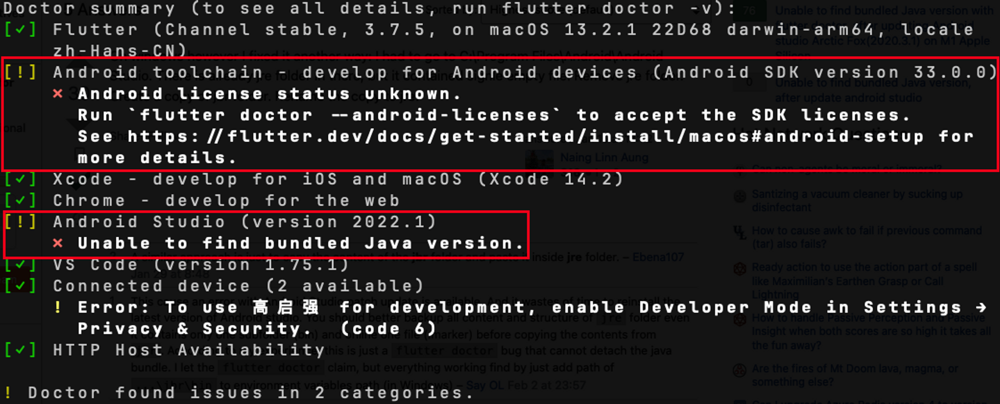
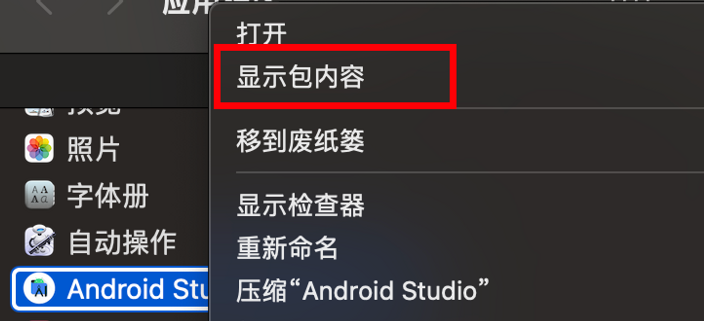
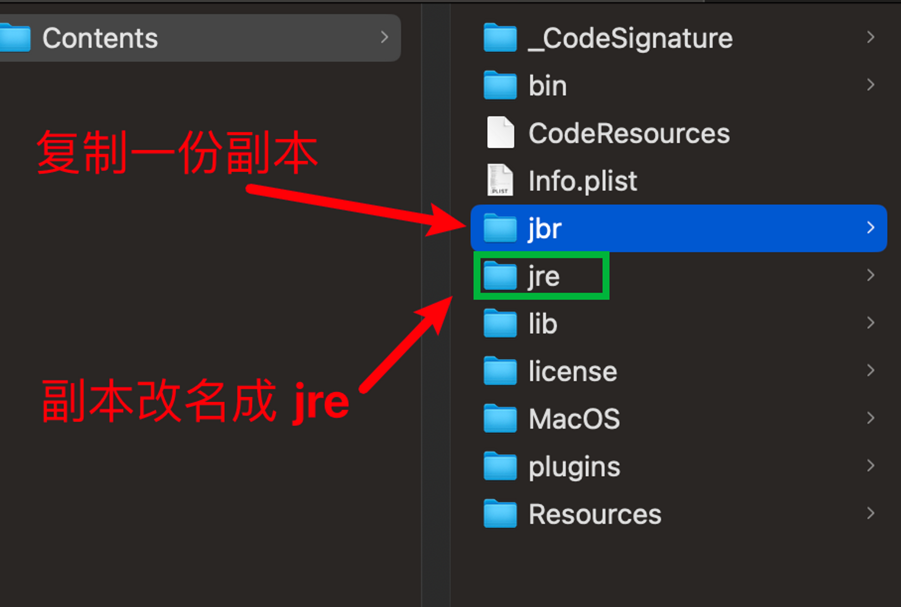

## 更新Android Studio (version 2022.1)后doctor报错

```js
# [Unable to find bundled Java version [duplicate]](https://stackoverflow.com/questions/75115909/flutter-android-studio-version-2022-1-x-unable-to-find-bundled-java-versio)
```



## 解决步骤 - MAC


### 一 : 找到引用程序,点击右键显示包内容



### 二: 复制 jbr , 粘贴副本改名成 jre


