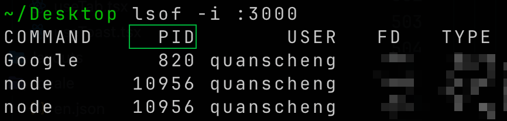

# MacOS停止制定端口的进程

前段时间升级了vscode之后， 发现升级或者在开发服务器未关闭的情况下，重启vscode没有停止对应端口的进程，导致一个现象就是：开发服务器未关闭重启vscode端口被莫名占用。

找到了两个命令查询对应端口占用的进程：

```bash
lsof -i :3000
```



```bash title="停止进程"
kill -9 10956
```

