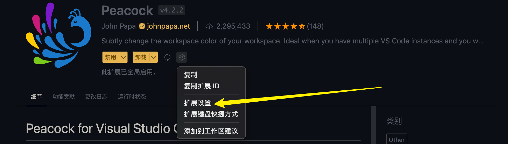
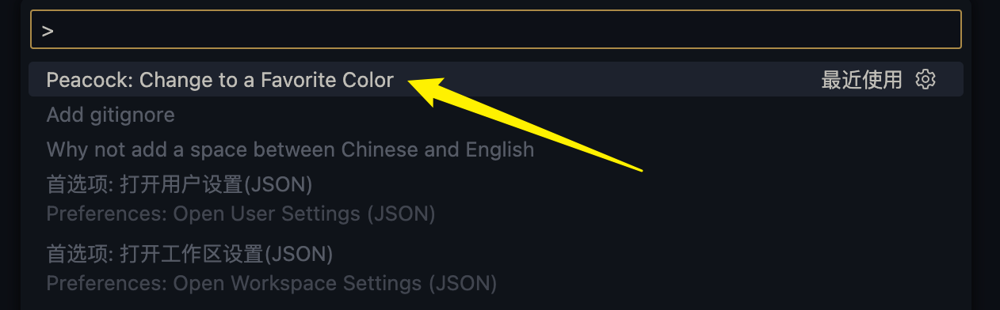

## 安装

[扩展市场: peacock](https://marketplace.visualstudio.com/items?itemName=johnpapa.vscode-peacock)

## 配置

因为一般都有自己喜欢的主题, 我使用的是暗色主题 [Ayu](https://marketplace.visualstudio.com/items?itemName=teabyii.ayu),所以默认配置是把侧边栏,状态栏,标题栏都换了颜色, 有点扎眼, 不过由于右下角的remote标志是比较亮的颜色, 所以就配置成底部状态栏颜色区分,就比较舒服了.



### 只设置状态栏


### 配置预设颜色


```json
 "peacock.favoriteColors": [
    {
      "name": "漩涡鸣人",
      "value": "#ff8906"
    },
    {
      "name": "宇智波佐助",
      "value": "#6246ea"
    },
    {
      "name": "春野樱",
      "value": "#fec7d7"
    },
    {
      "name": "旗木卡卡西",
      "value": "#078080"
    },
    {
      "name": "日向雏田",
      "value": "#bae8e8"
    },
    {
      "name": "Node Green",
      "value": "#215732"
    },
    {
      "name": "雾霾蓝",
      "value": "#232946"
    },
    {
      "name": "尘埃灰",
      "value": "#72757e"
    },
    {
      "name": "森林绿",
      "value": "#00473e"
    },
    {
      "name": "星空黑",
      "value": "#0f0e17"
    },
    {
      "name": "原野绿",
      "value": "#215732"
    },
  ],
```

## 设置成功



