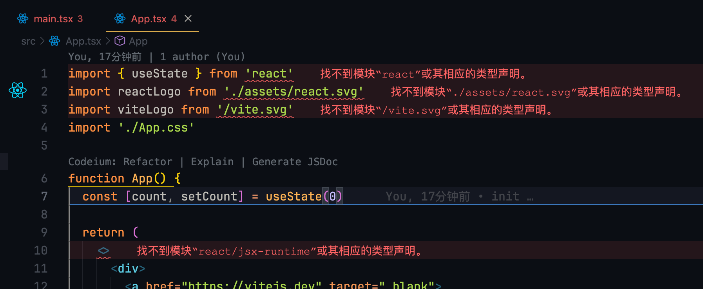

## 包管理器

如果使用`yarn`安装, 新版本 yarn 管理会把下载的包管理至.yarn 文件夹,node_modules 里面基本就是链接的形式, 所以会出现下面的情况, ==正常运行,但是 ts 服务器检测不到包==:



使用`npm`或者`pnpm`就没有这个问题.

## vite.config.ts 使用 node 模块

需要安装一下 node 的类型包

```
@types/node
```
