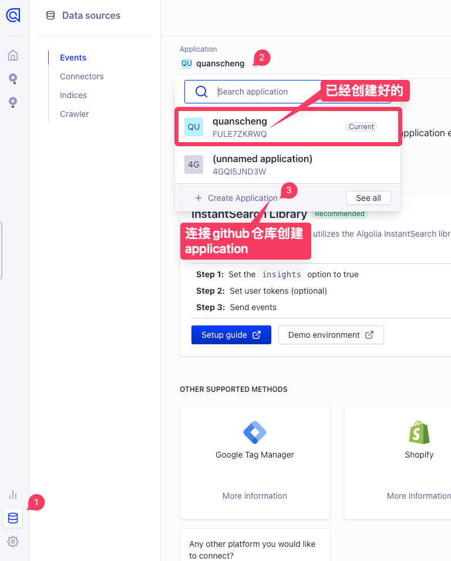
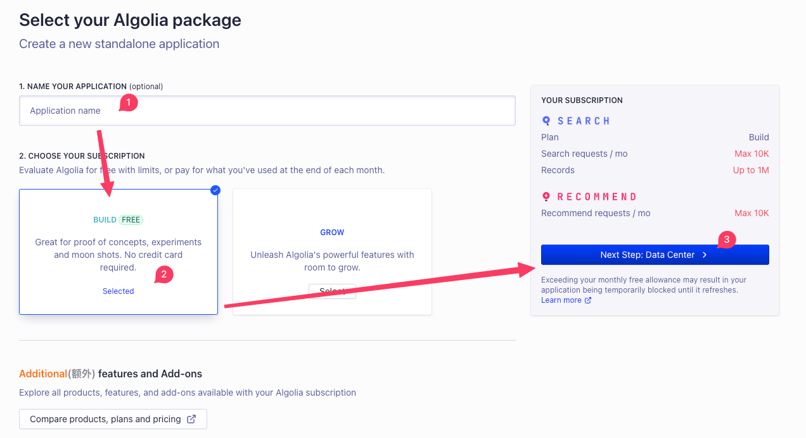
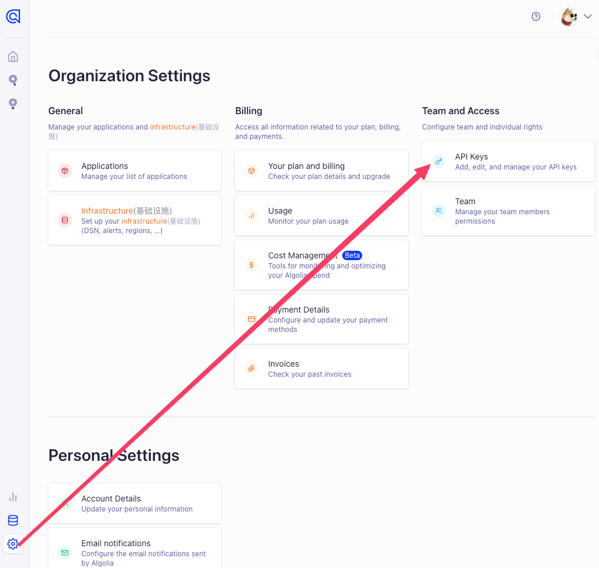
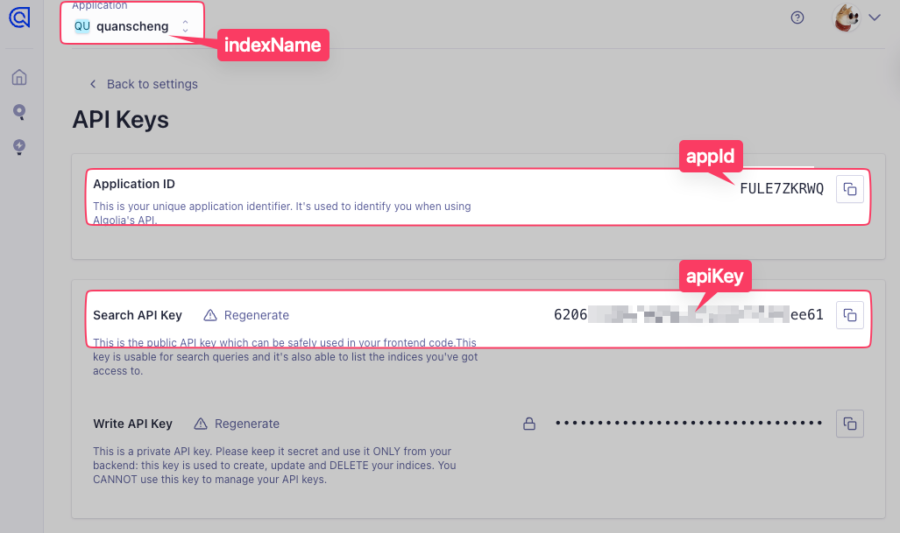

## 指引

[链接: 使用 Algolia DocSearch 官方指引](https://docusaurus.io/zh-CN/docs/search)

[链接: 申请 DocSearch](https://docsearch.algolia.com/apply/)

提交后大约 1-2天内会收到 反馈邮件, 通知注册成功. 然后登录到 [个人中心](https://dashboard.algolia.com/)








## 配置

```json title="docusaurus.config.js"
algolia: {
  // The application ID provided by Algolia
  appId: '',
  // Public API key: it is safe to commit it
  apiKey: '',
  // algolia application name
  indexName: '',
  // ... ...
},
```


