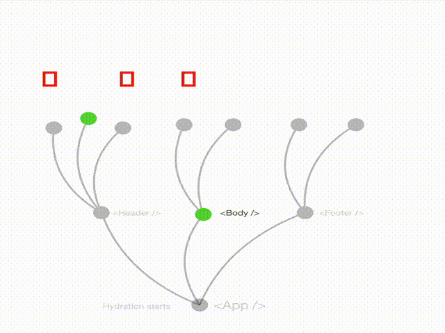

## hydration

当 React、Vue、Svelte 或 Angular 等 SPA 框架添加了 SSR 支持时，水合作为一种算法首次出现。为了使这些框架在浏览器中变得交互式，它们必须从根 () 重新执行整个应用程序，以恢复序列化为 HTML (renderToString) 时丢失的状态和事件处理程序。

所有水合实现都将单个组件作为根（通常是 ），为了使其具有交互性，树中的每个组件都必须执行。只有在设置了事件处理程序之后，用户才能与其交互。

水合作用只能通过向先前在服务器中执行的组件树添加交互性的过程来理解。这是一个 O(n) 算法，其中 N 是要唤醒的组件数量。

## partial hydration

Astro 框架凸显了部分水合的概念，它源于这样的理解：并非树的所有部分都需要水合，特别是那些完全静态的部分。这种方法建立了“交互岛”，减少了浏览器的工作负载，从而实现更快的交互。

部分水合正是这样的：在不同时刻多次调用 HydroRoot()，所以这个名字很合适。

然而，必须强调的是，这些“交互岛”需要由开发人员手动创建。此外，这些岛会创建边界，这意味着每个岛都作为独立的子应用程序运行，这可能会阻碍应用程序不同部分之间的通信。

## React Server Component is hydration

就像部分水合一样，RSC 是具有不同姓氏的水合，我们可以将其称为稀疏水合(**Sparse Hydration**)。

RSC 没有创建孤立的岛屿，而是维护单个根，允许组件相互通信。但是，根目录中的“服务器组件”不需要在浏览器中重新执行。相反，React 将这些组件的 vNode 作为数据序列化到 HTML 中。这是一种时空权衡([Space–time tradeoff](https://zh.wikipedia.org/wiki/%E6%97%B6%E7%A9%BA%E6%9D%83%E8%A1%A1))。

就像孤岛架构一样，开发人员必须努力使用“使用服务器”或“使用客户端”指令在 React 服务器组件中设置边界。

## 可恢复性(Resumability)本质上是一种不同的算法

(Resumability is fundamentally a different algorithm) 最后，我们深入研究了可恢复性，这是一种提倡即时交互性的范例，无需水合或爬行组件。它完全脱离了树结构。

可恢复性的独特之处在于根（或入口点）是事件处理程序，而不是组件。

在传统的水合、部分水合和 React Server 组件中，组件充当根。对于部分水合，您可能有多个根，而对于 React Server 组件，您只有一个根。

另一方面，可恢复性将事件处理程序置于根位置。箭头从事件指向组件，表明不需要运行任何用户代码，即使对于可以重新渲染的组件也是如此。这种方法有效地将所有组件视为静态的，无论它们是否是静态的。

>  参考原文
>
> [hydration-tree-resumability-map](https://www.builder.io/blog/hydration-tree-resumability-map)

