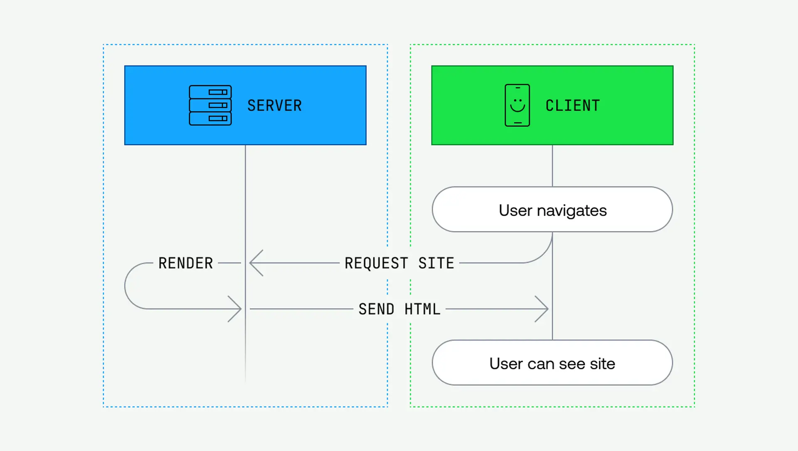
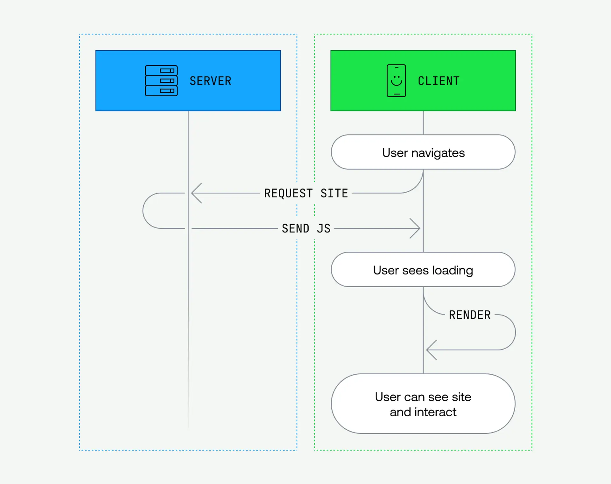
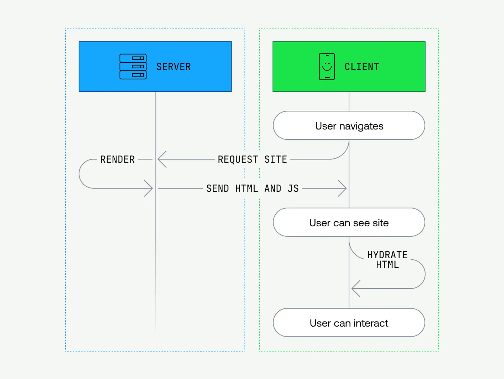
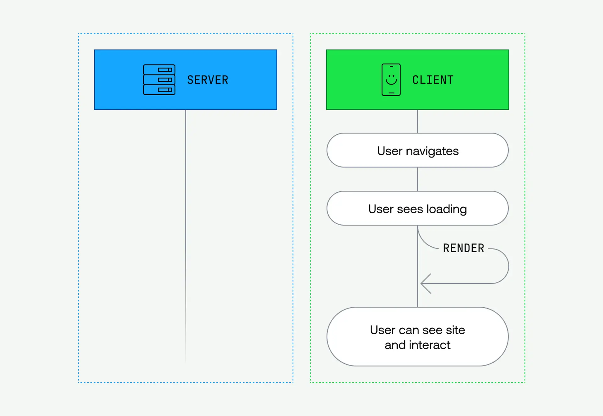
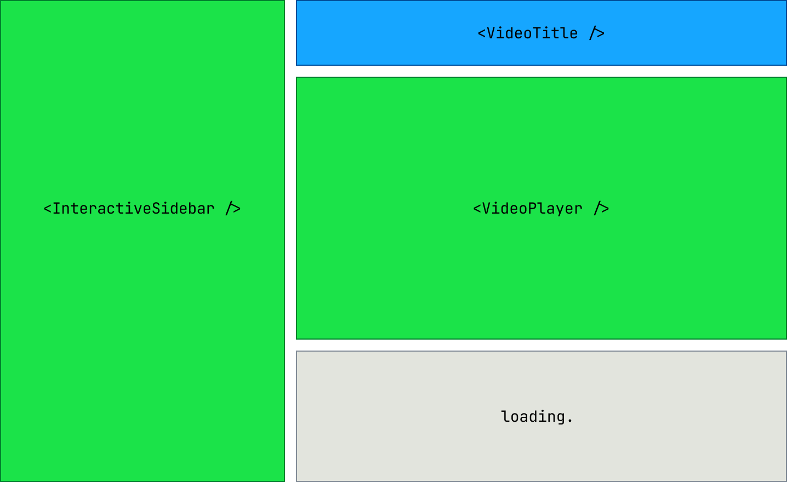

## 一 . 最开始 : PHP 时代

## 二 . 更多交互 : CSR 时代

> 客户端渲染会收到渲染网站所需的js

> 客户端已经具备渲染代码, 从而不需要跟服务器通信

## 三 . 更好的 SEO: 服务端渲染(SSR)/静态站点生成(SSG)

> 客户端可以短时间看到静态网页, 但是需要更多时间加载js和 hydrate

> 后续导航跟CSR一样, SSR拥有显示下一页所需要的所有渲染代码, 因此切换速度很快

> 问题 : 大多数 SSR/SSG 方法将*用于生成页面的所有 JavaScript*发送到客户端，然后客户端*再次运行所有内容*，并将该 HTML 与刚刚启动的 JavaScript 结合起来。我们真的需要发送并运行所有 JavaScript 吗？我们真的需要重复所有渲染工作只是为了水合吗？如果服务器端渲染需要很长时间怎么办？

## 四 . React Server Component

1. 可以此定义哪些组件代码需要在服务器运行

2. 服务器组件可以*直接从组件内部*获取数据。获取完成后，服务器组件可以将该数据*流式传输*到客户端。

3. 加载慢的服务器组件,可以有单独的加载, 其他并不影响

