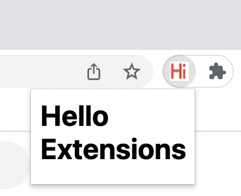
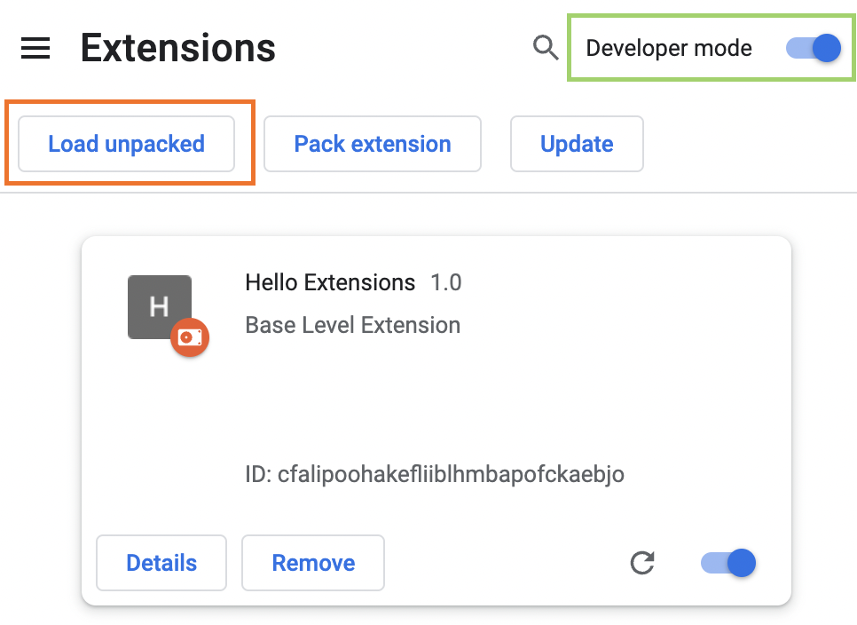
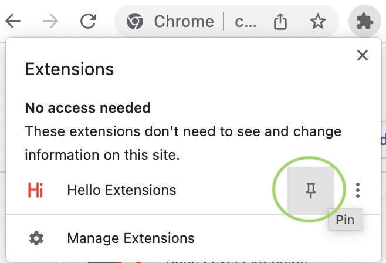
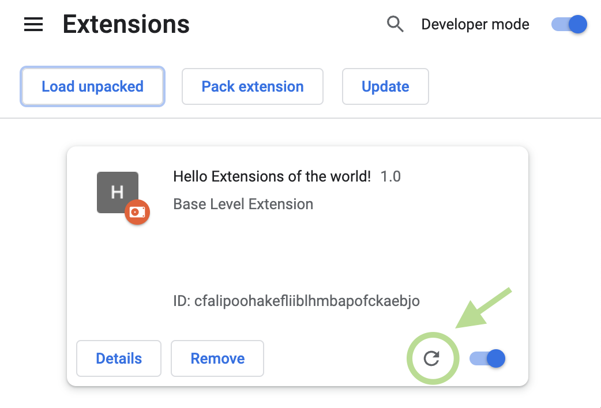
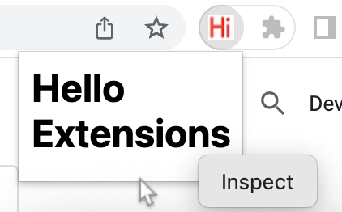
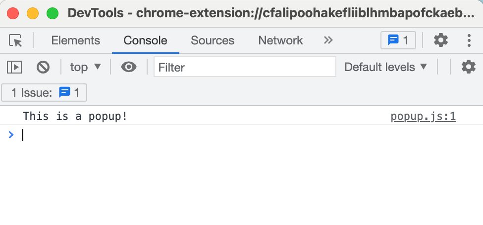
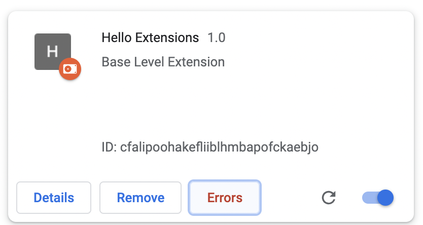
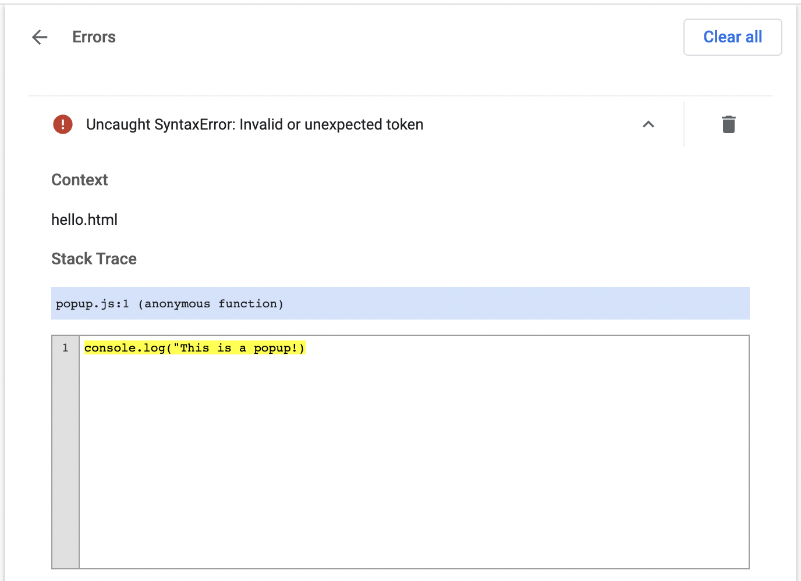
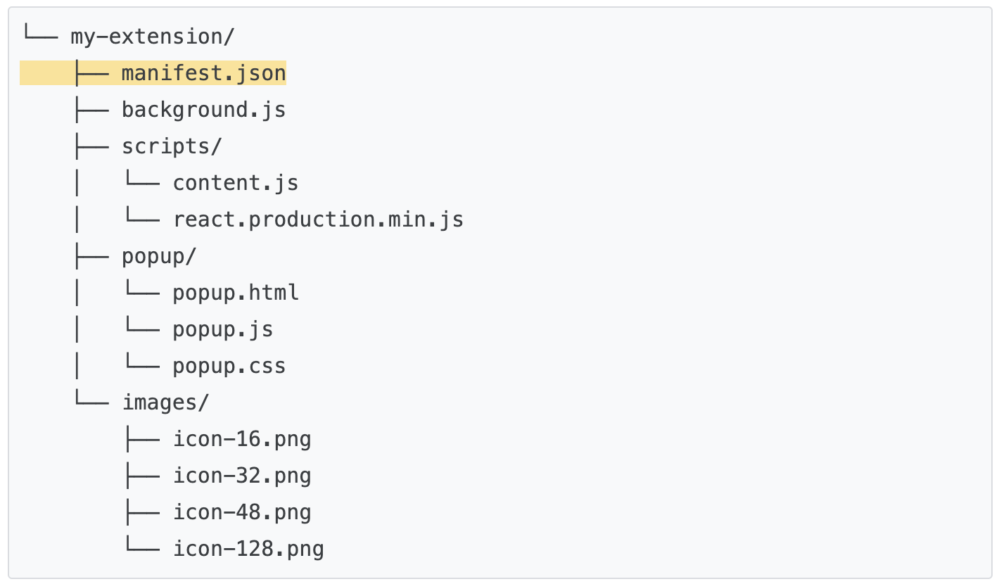

## 开发基础

> 完成  Hello Extensions



### 创建manifest.json文件

在此目录中创建一个名为的新文件`manifest.json`并添加以下代码：

```json
{
  "manifest_version": 3,
  "name": "Hello Extensions",
  "description": "Base Level Extension",
  "version": "1.0",
  "action": {
    "default_popup": "hello.html",
    "default_icon": "hello_extensions.png"
  }
}
```

这个 JSON 对象描述了扩展的功能和配置。

例如，该`"action"`键声明 Chrome 应使用的图像作为操作的图标，以及在单击操作时在弹出窗口中显示的 HTML 页面。[将图标下载](https://storage.googleapis.com/web-dev-uploads/image/WlD8wC6g8khYWPJUsQceQkhXSlv1/gmKIT88Ha1z8VBMJFOOH.png)到您的目录，并确保更改其名称以匹配`"default_icon"`密钥中的内容。

### 弹出窗口

对于弹出窗口，创建一个名为 的文件`hello.html`，并添加以下代码：

```html
<html>
  <body>
    <h1>Hello Extensions</h1>
  </body>
</html>
```

## 调试扩展

在开发者模式下加载一个解压的扩展：

1. 通过输入`chrome://extensions`新选项卡进入扩展页面。（根据设计`chrome://`，URL 不可链接。）

   - 或者，单击扩展菜单拼图按钮，然后选择菜单底部的**管理扩展。**
   - 或者，单击 Chrome 菜单，将鼠标悬停在**更多工具上，**然后选择**扩展程序**。

2. 通过单击开发人员模式旁边的切换开关启用开发**人员模式**。

3. 单击**Load unpacked**按钮并选择扩展目录。

   扩展页面 (chrome://extensions)

达达！扩展已成功安装。因为清单中没有包含扩展图标，所以将为扩展创建一个通用图标。

## 固定扩展

默认情况下，当您在本地加载扩展程序时，它会出现在扩展程序菜单中。将您的扩展固定到工具栏，以便在开发期间快速访问您的扩展。

固定扩展

单击扩展程序的操作（工具栏图标）；你应该看到一个弹出窗口。


## 重新加载扩展

让我们回到代码，把扩展名改成“Hello Extensions of the world！” 在清单中。

```json
{
  "manifest_version": 3,
  "name": "Hello Extensions of the world!",
  ...
}
```

保存文件后，要在浏览器中查看此更改，您还必须刷新扩展。转到扩展页面并单击**开/关**切换旁边的刷新图标：



## 查找控制台日志和错误

###  控制台日志

在开发过程中，您可以通过访问浏览器控制台日志来调试代码。在这种情况下，我们将找到弹出窗口的日志。首先将脚本标签添加到`hello.html`.

```html
<html>
  <body>
    <h1>Hello Extensions</h1>
    <script src="popup.js"></script>
  </body>
</html>
```

创建一个`popup.js`文件并添加以下代码：

```js
console.log("This is a popup!")
```

要查看控制台中记录的此消息：

1. 刷新扩展。

2. 打开弹出窗口。

3. 右键单击弹出窗口。

4. 选择->检查。

   检查弹出窗口

5. 在[DevTools](https://developer.chrome.com/docs/devtools/)中，导航到**控制台**面板。

DevTools 控制台面板

### 错误日志

现在让我们打破扩展。我们可以通过删除结束引号来做到这一点`popup.js`：

```js
console.log("This is a popup!) // ❌ broken code
```

转到扩展页面并打开弹出窗口。将出现一个**错误**按钮。



单击**错误**按钮以了解有关错误的更多信息：



要了解有关调试服务工作者、选项页面和内容脚本的更多信息，请参阅[调试扩展](https://developer.chrome.com/docs/extensions/mv3/tut_debugging/)。

## 构建扩展项目

有很多方法可以构建扩展项目；但是，您必须将 manifest.json 文件放在扩展的**根目录**中。下面是一个结构示例：



## 使用TypeScript

如果您使用VSCode 或 Atom 等[代码编辑器进行开发，则可以使用 npm 包](https://developer.mozilla.org/docs/Glossary/IDE)[chrome-types](https://www.npmjs.com/package/chrome-types)来利用[Chrome API](https://developer.chrome.com/docs/extensions/reference/)的自动完成功能。当 Chromium 源代码更改时，此 npm 包会自动更新。
