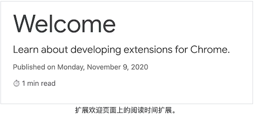
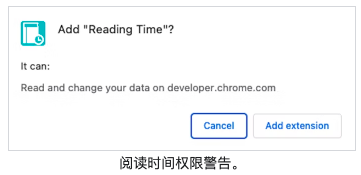
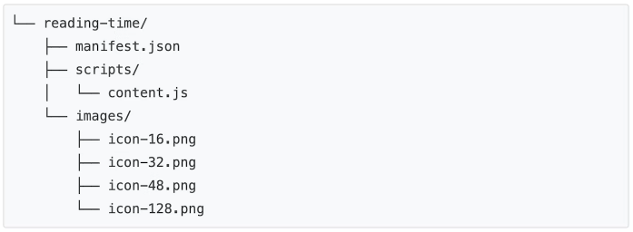
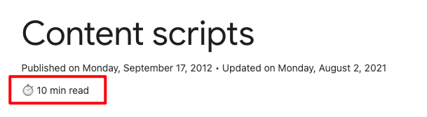

## 案例: 阅读时间

> 创建在页面上插入新元素的第一个扩展。

## 概述

本教程构建了一个扩展，它将预期的阅读时间添加到任何 Chrome 扩展和 Chrome Web Store 文档页面。



在本指南中，我们将解释以下概念：

- 扩展清单。
- 扩展使用的图标大小。
- [如何使用内容脚本](https://developer.chrome.com/docs/extensions/mv3/content_scripts/)将代码注入页面。
- 如何使用匹配模式。
- 扩展权限。

## 开始之前

本指南假定您具有基本的 Web 开发经验。我们建议查看[开发谷歌扩展(二)基础](./chrome-extension-2.md)以了解扩展开发工作流程的介绍。

## 构建扩展

首先，创建一个名为`reading-time`保存扩展文件的新目录。如果您愿意，可以从[Github](https://github.com/GoogleChrome/chrome-extensions-samples/tree/main/tutorials/reading-time)下载完整的源代码。

### 第 1 步：添加有关扩展的信息

清单 JSON 文件是唯一需要的文件。它包含有关扩展的重要信息。*在项目的根目录*下创建一个`manifest.json`文件并添加以下代码：

```json
{
  "manifest_version": 3,
  "name": "Reading time",
  "version": "1.0",
  "description": "Add the reading time to Chrome Extension documentation articles",
}
```

这些键包含扩展的基本元数据。他们控制扩展在扩展页面上的显示方式，以及在发布时在 Chrome 网上应用店中的显示方式。要深入了解，请查看[Manifest](https://developer.chrome.com/docs/extensions/mv3/manifest/)概览页面上的[`"name"`](https://developer.chrome.com/docs/extensions/mv3/manifest/name/)、[`"version"`](https://developer.chrome.com/docs/extensions/mv3/manifest/version/)和[`"description"`](https://developer.chrome.com/docs/extensions/mv3/manifest/description/)键。

### 第 2 步：提供图标

那么，为什么我们需要图标？尽管[图标](https://developer.chrome.com/docs/extensions/mv3/manifest/icons/)在开发过程中是可选的，但如果您计划在 Chrome Web Store 上分发您的扩展程序，它们是必需的。它们也出现在扩展页面等其他地方。

创建一个`images`文件夹并将图标放入其中。[你可以在Github](https://github.com/GoogleChrome/chrome-extensions-samples/tree/main/tutorials/reading-time/images)上下载图标。接下来，将突出显示的代码添加到清单中以声明图标：

```json
{
  ...
  "icons": {
    "16": "images/icon-16.png",
    "32": "images/icon-32.png",
    "48": "images/icon-48.png",
    "128": "images/icon-128.png"
  }
  ...
}
```

> 我们建议使用 PNG 文件，但允许使用其他文件格式，SVG 文件除外。
>
> | 图标大小 | 图标使用                             |
> | -------- | ------------------------------------ |
> | 16x16    | 扩展页面上的图标和上下文菜单图标。   |
> | 32x32    | Windows 计算机通常需要这种尺寸。     |
> | 48x48    | 显示在扩展页面上。                   |
> | 128x128  | 在安装时和 Chrome 网上应用店中显示。 |

### 第 3 步：声明内容脚本

扩展程序可以运行读取和修改页面内容的脚本。这些被称为*内容脚本*。他们生活在一个[孤立的世界](https://developer.chrome.com/docs/extensions/mv3/content_scripts/#isolated_world)中，这意味着他们可以更改他们的 JavaScript 环境，而不会与他们的主机页面或其他扩展程序的内容脚本发生冲突。

将以下代码添加到`manifest.json`以注册名为`content.js`.

```json
{
  ...
  "content_scripts": [
      {
        "js": ["scripts/content.js"],
        "matches": [
	   	 "https://developer.chrome.com/docs/extensions/*",
          "https://developer.chrome.com/docs/webstore/*"
        ]
      }
    ]
}
```

该`"matches"`字段可以有一个或多个[匹配模式](https://developer.chrome.com/docs/extensions/mv3/match_patterns/)。这些允许浏览器识别将内容脚本注入哪些站点。匹配模式由三部分组成`<scheme>://<host><path>`。它们可以包含 ' `*`' 字符。

> **这个扩展是否显示权限警告？**
>
> 当用户安装扩展程序时，浏览器会通知他们扩展程序可以做什么。内容脚本请求在满足匹配模式标准的站点上运行的权限。
>
> 在此示例中，用户将看到以下权限警告：
>
> 
>
> 要深入了解扩展权限，请参阅[声明权限并警告用户](https://developer.chrome.com/docs/extensions/mv3/permission_warnings/)。

### 第 4 步：计算并插入阅读时间

内容脚本可以使用标准[文档对象模型](https://developer.mozilla.org/docs/Web/API/Document_Object_Model)(DOM) 来读取和更改页面内容。扩展将首先检查页面是否包含该`<article>`元素。然后，它将计算该元素中的所有单词并创建一个显示总阅读时间的段落。

`content.js`在名为的文件夹中创建一个名为的文件`scripts`并添加以下代码：

```js
const article = document.querySelector('article')

// `document.querySelector` 如果选择器不匹配任何东西，则可能返回null。
if (article) {
  const text = article.textContent
  const wordMatchRegExp = /[^\s]+/g // 正则表达式用于仅计算<article>元素内的单词。

  const words = text.matchAll(wordMatchRegExp)
  // matchAll返回一个迭代器，转换为数组以获得字数
  const wordCount = [...words].length
  const readingTime = Math.round(wordCount / 200)
  const badge = document.createElement('p')
  // 在文章的标题中使用与发布信息相同的样式
  badge.classList.add('color-secondary-text', 'type--caption')
  badge.textContent = `⏱️ ${readingTime} min read`

  // Support for API reference docs
  const heading = article.querySelector('h1')
  // Support for article docs with date
  const date = article.querySelector('time')?.parentNode

  // InsertAdjacentElement()用于在元素后面插入读取时间节点。
  ;(date ?? heading).insertAdjacentElement('afterend', badge)
}
```

> - [正则表达式](https://developer.mozilla.org/docs/Web/JavaScript/Guide/Regular_Expressions#writing_a_regular_expression_pattern)用于仅计算`<article>`元素内的单词。
> - [InsertAdjacentElement()](https://developer.mozilla.org/docs/Web/API/Element/insertAdjacentElement)用于在元素后面插入读取时间节点。
> - Classlist属性用于将 CSS 类名称添加到元素类属性[。](https://developer.mozilla.org/docs/Web/API/Element/classList)
> - 用于访问可能未定义或为空的对象属性的[可选链接。](https://developer.mozilla.org/docs/Web/JavaScript/Reference/Operators/Optional_chaining)
> - `<heading>`如果`<date>`为 null 或未定义，则[Nullish 合并](https://developer.mozilla.org/docs/Web/JavaScript/Reference/Operators/Nullish_coalescing_operator)返回。

## 测试它是否有效

验证项目的文件结构是否如下所示：



### 本地加载您的扩展程序

要在开发人员模式下加载解压缩的扩展，请按照[开发谷歌扩展(二)基础](./chrome-extension-2.md)中的步骤进行操作。

打开: https://developer.chrome.com/docs/extensions/mv3/

或者: https://developer.chrome.com/docs/extensions/mv3/content_scripts/

