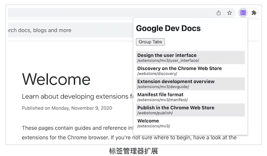
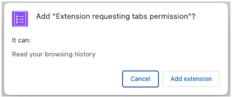
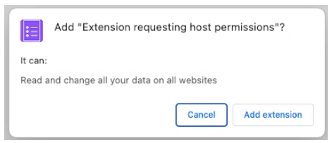
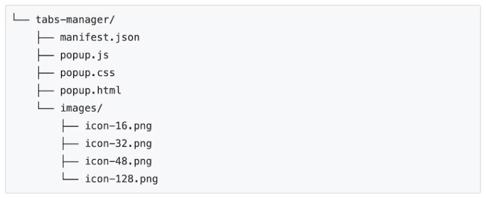
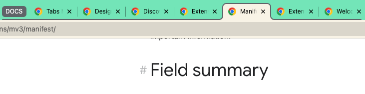

> 构建您的第一个标签管理器。

## 概述

本教程构建了一个标签管理器来组织您的 Chrome 扩展和 Chrome 网上商店文档标签。



在本指南中，我们将解释如何执行以下操作:

- [使用 Action](https://developer.chrome.com/docs/extensions/reference/action/) API创建一个扩展弹出窗口。
- [使用 Tabs](https://developer.chrome.com/docs/extensions/reference/tabs/)API查询特定选项卡。
- 通过收缩主机权限保护用户隐私。
- 更改选项卡的焦点。
- 将选项卡移动到同一窗口并将它们分组。
- [使用 TabGroups](https://developer.chrome.com/docs/extensions/reference/tabGroups/) API重命名选项卡组。

## 开始之前

本指南假定您具有基本的 Web 开发经验。我们建议查看[开发谷歌扩展(二)基础](./chrome-extension-2.md)以了解扩展开发工作流程的介绍。

## 构建扩展

首先，创建一个名为`tabs-manager`保存扩展文件的新目录。如果您愿意，可以在[GitHub 上](https://github.com/GoogleChrome/chrome-extensions-samples/tree/main/tutorials/tabs-manager)下载完整的源代码。

### 第 1 步：添加扩展数据和图标

```json
{
  "manifest_version": 3,
  "name": "Tab Manager for Chrome Dev Docs",
  "version": "1.0",
  "icons": {
    "16": "images/icon-16.png",
    "32": "images/icon-32.png",
    "48": "images/icon-48.png",
    "128": "images/icon-128.png"
  },
}
```

图标在`开发谷歌扩展(三/四)`已经下载好了,直接复用即可

### 第 2 步：创建弹出窗口并设置样式

[Action](https://developer.chrome.com/docs/extensions/reference/action/) API 控制扩展操作（工具栏图标）。当用户单击扩展操作时，它将运行一些代码或打开一个弹出窗口，就像在这种情况下一样。首先在以下声明弹出窗口`manifest.json`：

```json
{
  ...
  "action": {
    "default_popup": "popup.html"
  },
  ...
}
```

弹出窗口类似于网页，但有一个区别：它不能运行内联 JavaScript。创建一个`popup.html`文件并添加以下代码：

```html
<!DOCTYPE html>
<html lang="en">
  <head>
    <meta charset="UTF-8" />
    <meta
      http-equiv="X-UA-Compatible"
      content="IE=edge"
    />
    <meta
      name="viewport"
      content="width=device-width, initial-scale=1.0"
    />
    <link
      rel="stylesheet"
      href="./popup.css"
    />
  </head>
  <body>
    <template id="li_template">
      <li>
        <a>
          <h3 class="title">Tab Title</h3>
          <p class="pathname">Tab Pathname</p>
        </a>
      </li>
    </template>

    <h1>Google Dev Docs</h1>
    <button>Group Tabs</button>
    <ul></ul>

    <script
      src="./popup.js"
      type="module"
    ></script>
  </body>
</html>
```

> **提示**：您可以通过添加`type="module”`到脚本标签来使用[顶层 await](https://developer.mozilla.org/docs/Web/JavaScript/Reference/Operators/await#top_level_await)

接下来，让我们为弹出窗口设置样式。创建一个`popup.css`文件并添加以下代码：

```css
body {
  width: 20rem;
}

ul {
  list-style-type: none;
  padding-inline-start: 0;
  margin: 1rem 0;
}

li {
  padding: 0.25rem;
}
li:nth-child(odd) {
  background: #80808030;
}
li:nth-child(even) {
  background: #ffffff;
}

h3,
p {
  margin: 0;
}
```

### 第 3 步：管理选项卡

[Tabs API](https://developer.chrome.com/docs/extensions/reference/tabs/)允许扩展在浏览器中创建、查询、修改和重新排列选项卡。

#### 请求许可

Tabs API 中的许多方法无需请求任何权限即可使用。但是，我们需要访问选项卡的 `title`和 `URL`这些敏感属性需要许可。我们可以请求`"tabs"`权限，但这将允许访问**所有**选项卡的敏感属性。由于我们只管理特定站点的选项卡，因此我们将请求狭窄的主机权限。

收紧的[主机权限允许我们通过授予](https://developer.chrome.com/docs/extensions/mv3/match_patterns/)**特定网站**更高的权限来保护用户隐私。这将授予对`title`、 和`URL`属性的访问权限以及其他功能。将突出显示的代码添加到`manifest.json`文件中：

```json
{
  ...
  "host_permissions": [
    "https://developer.chrome.com/*"
  ],
  ...
}
```

> **tabs 权限和主机权限的主要区别是什么？**
>
> `"tabs"`权限和主机权限都有缺点。
>
> 该`"tabs"`权限授予扩展读取所有选项卡上的敏感数据的能力。随着时间的推移，此信息可用于收集用户的浏览历史记录。因此，如果您请求此权限，Chrome 将在安装时显示以下警告消息：
>
> 
>
> 主机权限允许扩展读取和查询匹配选项卡的敏感属性，并在这些选项卡上注入脚本。用户将在安装时看到以下警告消息：
>
> 
>
> 这些警告可能会让用户感到震惊。为了获得更好的引导使用体验，我们建议实施[可选权限](https://developer.chrome.com/docs/extensions/reference/permissions/)。

#### 查询选项卡

`tabs.query()`您可以使用该方法从特定 URL 检索选项卡。创建一个`popup.js`文件并添加以下代码：

```js
const tabs = await chrome.tabs.query({
  url: [
    "https://developer.chrome.com/docs/webstore/*",
    "https://developer.chrome.com/docs/extensions/*",
  ],
});
// ...
```

> **我可以直接在弹窗中使用 Chrome API 吗？**
>
> 弹出窗口和其他扩展页面可以调用任何[Chrome API](https://developer.chrome.com/docs/extensions/reference/)，因为它们是从 chrome 架构提供的。例如`chrome-extension://EXTENSION_ID/popup.html`.

#### 专注于一个选项卡

首先，扩展程序将按字母顺序对选项卡名称（包含的 HTML 页面的标题）进行排序。然后，当单击列表项时，它将使用 聚焦在该选项卡上，`tabs.update()`并使用 将窗口置于最前面`windows.update()`。将以下代码添加到`popup.js`文件中：

```js
//...
const collator = new Intl.Collator();
tabs.sort((a, b) => collator.compare(a.title, b.title));

const template = document.getElementById("li_template");
const elements = new Set();
for (const tab of tabs) {
  const element = template.content.firstElementChild.cloneNode(true);

  const title = tab.title.split("-")[0].trim();
  const pathname = new URL(tab.url).pathname.slice("/docs".length);

  element.querySelector(".title").textContent = title;
  element.querySelector(".pathname").textContent = pathname;
  element.querySelector("a").addEventListener("click", async () => {
    // 需要聚焦窗口以及活动选项卡
    await chrome.tabs.update(tab.id, { active: true });
    await chrome.windows.update(tab.windowId, { focused: true });
  });

  elements.add(element);
}
document.querySelector("ul").append(...elements);
//...
```

> **这段代码中使用了有趣的 JavaScript**
>
> - [Intl.Collator](https://developer.mozilla.org/zh-CN/docs/Web/JavaScript/Reference/Global_Objects/Intl/Collator)用于按用户首选语言对制表符数组排序的排序器。
> - [`<template>`](https://web.dev/webcomponents-template/)用于定义可以克隆的 HTML 元素，而不是用于`document.createElement()`创建每个元素。
> - [URL 构造函数](https://developer.mozilla.org/docs/Web/API/URL/URL)用于生成和解析 URLs

#### 对选项卡进行分组

TabGroups API 允许扩展命名组并选择背景颜色[。](https://developer.chrome.com/docs/extensions/reference/tabGroups/)`“tabGroups”`通过添加突出显示的代码将权限添加到清单：

```json
{
  ...
  "permissions": [
    "tabGroups"
  ]
}
```

在`popup.js`中，添加以下代码以创建一个按钮，该按钮将使用的所有选项卡分组[`tabs.group()`](https://developer.chrome.com/docs/extensions/reference/tabGroups/)并将它们移动到当前窗口中。

```js
...
const button = document.querySelector("button");
button.addEventListener("click", async () => {
  const tabIds = tabs.map(({ id }) => id);
  const group = await chrome.tabs.group({ tabIds });
  await chrome.tabGroups.update(group, { title: "DOCS" });
});
```

## 测试它是否有效

验证您的项目的文件结构是否与以下目录树匹配：



### 在本地加载您的扩展程序

要在开发人员模式下加载解压缩的扩展，请按照[开发谷歌扩展(二)基础](./chrome-extension-2.md)中的步骤进行操作。

### 打开几个文档页面

在不同的窗口中打开以下文档：

- [设计用户界面](https://developer.chrome.com/docs/extensions/mv3/user_interface/)
- [在 Chrome 网上应用店中发现](https://developer.chrome.com/docs/webstore/discovery/)
- [扩展开发概述](https://developer.chrome.com/docs/extensions/mv3/devguide/)
- [清单文件格式](https://developer.chrome.com/docs/extensions/mv3/manifest/)
- [在 Chrome 网上应用店中发布](https://developer.chrome.com/docs/webstore/publish/)
- [欢迎来到 Chrome 扩展开发](https://developer.chrome.com/docs/extensions/mv3/)

点击插件: 


点击 Group Tabs


