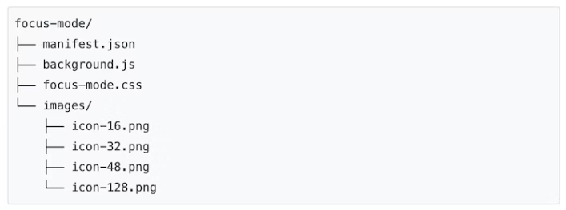
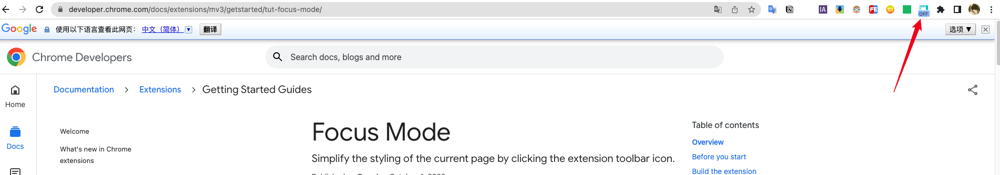
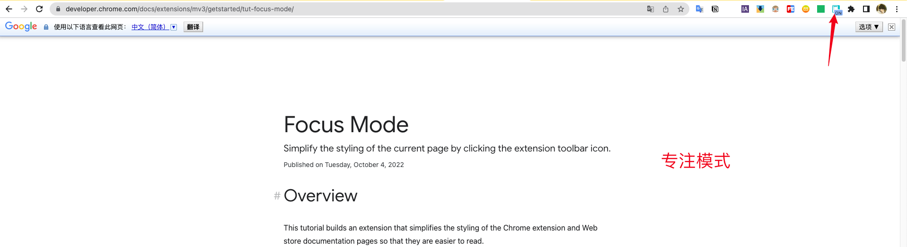

## 概述

本教程构建了一个扩展，它简化了 Chrome 扩展和网上商店文档页面的样式，使其更易于阅读。

在本指南中，我们将解释如何执行以下操作：

- 使用扩展`service worker`作为事件协调器。
- 通过 `activeTab `权限保护用户隐私。
- 当用户单击扩展工具栏图标时运行代码。
- [使用 chrome.scripting ](https://developer.chrome.com/docs/extensions/reference/scripting/)API插入和删除样式表。
- 使用键盘快捷键执行代码。

## 开始之前

本指南假定您具有基本的 Web 开发经验。我们建议查看[开发谷歌扩展(二)基础](./chrome-extension-2.md)以了解扩展开发工作流程的介绍。

## 构建扩展

首先，创建一个名为的新目录，该目录`focus-mode`将保存扩展的文件。如果您愿意，可以在[Github](https://github.com/GoogleChrome/chrome-extensions-samples/tree/main/tutorials/focus-mode)上下载完整的源代码。

### 第 1 步：添加扩展数据和图标

创建一个名为`manifest.json`并包含以下代码的文件。

```json
{
  "manifest_version": 3,
  "name": "Focus Mode",
  "description": "Enable reading mode on Chrome's official Extensions and Chrome Web Store documentation.",
  "version": "1.0",
  "icons": {
    "16": "images/icon-16.png",
    "32": "images/icon-32.png",
    "48": "images/icon-48.png",
    "128": "images/icon-128.png"
  }
}
```

要了解有关这些清单键的更多信息，请查看[阅读时间教程](./chrome-extension-3)

### 第 2 步：初始化扩展

[扩展可以使用扩展的 service worker](https://developer.chrome.com/docs/extensions/mv3/service_workers/)在后台监控浏览器事件。service worker 是特殊的 JavaScript 环境，它们被加载以处理事件并在不需要时终止。

首先在`manifest.json`文件中注册service worker：

```json
{
  ...
  "background": {
    "service_worker": "background.js"
  },
  ...
}
```

创建一个名为的文件`background.js`并添加以下代码：

```js
chrome.runtime.onInstalled.addListener(() => {
  chrome.action.setBadgeText({
    text: "OFF",
  });
});
```

我们的 service worker 将监听的第一个事件是[`runtime.onInstalled()`](https://developer.chrome.com/docs/extensions/reference/runtime#event-onInstalled). 此方法允许扩展设置初始状态或完成一些安装任务。扩展可以使用[Storage API](https://developer.chrome.com/docs/extensions/reference/storage/)和[IndexedDB](https://developer.mozilla.org/docs/Web/API/IndexedDB_API)来存储应用程序状态。但是，在这种情况下，由于我们只处理两种状态，我们将使用 *操作的标记( action's badge )* 文本本身来跟踪扩展是“开”还是“关”。

> [操作的标记](https://developer.chrome.com/docs/extensions/reference/action/#badge)是扩展操作（工具栏图标）顶部的彩色横幅。

### 第 3 步：启用扩展操作

*扩展操作( extension action )*控制扩展的工具栏图标。因此，每当用户单击扩展操作时，它要么运行一些代码（如本例所示），要么显示一个弹出窗口。添加以下代码以在`manifest.json`文件中声明扩展操作：

```json
{
  ...
  "action": {
    "default_icon": {
      "16": "images/icon-16.png",
      "32": "images/icon-32.png",
      "48": "images/icon-48.png",
      "128": "images/icon-128.png"
    }
  },
  ...
}
```

#### 使用activeTab权限保护用户隐私

该[`activeTab`](https://developer.chrome.com/docs/extensions/mv3/manifest/activeTab/)权限授予扩展在当前活动选项卡上执行代码的*临时*能力。它还允许访问当前选项卡的[敏感属性](https://developer.chrome.com/docs/extensions/mv3/manifest/activeTab/#what-activeTab-allows)。

此权限在用户***调用\***扩展程序时启用。在这种情况下，用户通过单击扩展操作来调用扩展。

> **还有哪些其他用户交互在我自己的扩展中启用了 activeTab 权限？**
>
> - 按下键盘快捷键组合。
> - 选择上下文菜单项。
> - 接受来自多功能框的建议。
> - 打开扩展弹出窗口。

该`activeTab`权限允许用户*有目的地*选择在焦点选项卡上运行扩展程序；这样，它保护了用户的隐私。另一个好处是它不会触发[权限警告](https://developer.chrome.com/docs/extensions/mv3/permission_warnings/#required_permissions)。

要使用`activeTab`权限，请将其添加到清单的权限数组中：

```json
{
  ...
  "permissions": ["activeTab"],
  ...
}
```

### 第 4 步：跟踪当前选项卡的状态

用户单击扩展操作后，扩展将检查 URL 是否与文档页面匹配。接下来，它将检查当前选项卡的状态并设置下一个状态。将以下代码添加到`background.js`：

```js
const extensions = 'https://developer.chrome.com/docs/extensions'
const webstore = 'https://developer.chrome.com/docs/webstore'

chrome.action.onClicked.addListener(async (tab) => {
  if (tab.url.startsWith(extensions) || tab.url.startsWith(webstore)) {
    // 检索动作标记，检查扩展状态是否为“ON”或“OFF”
    const prevState = await chrome.action.getBadgeText({ tabId: tab.id })
    // 下一个状态总是相反的
    const nextState = prevState === 'ON' ? 'OFF' : 'ON'

    // 将动作标记设置为下一个状态
    await chrome.action.setBadgeText({
      tabId: tab.id,
      text: nextState,
    })
  }
})
```

### 第 5 步：添加或删除样式表

现在是时候改变页面的布局了。创建一个名为`focus-mode.css`并包含以下代码的文件：

```css
body > .scaffold > :is(top-nav, navigation-rail, side-nav, footer),
main > :not(:last-child),
main > :last-child > navigation-tree,
main .toc-container {
  display: none;
}

main > :last-child {
  margin-top: min(10vmax, 10rem);
  margin-bottom: min(10vmax, 10rem);
}
```

[让我们使用Scripting](https://developer.chrome.com/docs/extensions/reference/scripting/) API插入或删除样式表。首先`"scripting"`在清单中声明权限：

```json
{
  ...
  "permissions": ["activeTab", "scripting"],
  ...
}
```

> **我可以使用 Scripting API 来注入代码而不是样式表吗？**
>
> 是的！您可以使用[`scripting.executeScript()`](https://developer.chrome.com/docs/extensions/reference/scripting/#injected-code)注入 JavaScript。

### *可选：分配键盘快捷键*

只是为了好玩，让我们添加一个快捷方式，以便更轻松地启用或禁用焦点模式。将`"commands" ` 这个 key 添加到清单中。 

```json
{
  ...
  "commands": {
    "_execute_action": {
      "suggested_key": {
        "default": "Ctrl+U",
        "mac": "Command+U"
      }
    }
  }
}
```

`"_execute_action"`密钥运行与事件相同的代码，`action.onClicked()`因此不需要额外的代码！

## 测试它是否有效

验证项目的文件结构是否如下所示：



### 在本地加载您的扩展程序

要在开发人员模式下加载解压缩的扩展，请按照[开发谷歌扩展(二)基础](./chrome-extension-2.md)中的步骤进行操作。

### 在文档页面上测试扩展

首先，打开以下任一页面：

- [欢迎使用 Chrome 扩展文档](https://developer.chrome.com/docs/extensions/mv3/)
- [在 Chrome 网上应用店中发布](https://developer.chrome.com/docs/webstore/publish/)
- [脚本 API](https://developer.chrome.com/docs/extensions/reference/scripting/)

然后，单击扩展操作。如果您设置了键盘快捷键（链接），您可以通过按`Ctrl + U`或来测试它`Cmd + U`。

它应该从这里开始：



变化时: 


